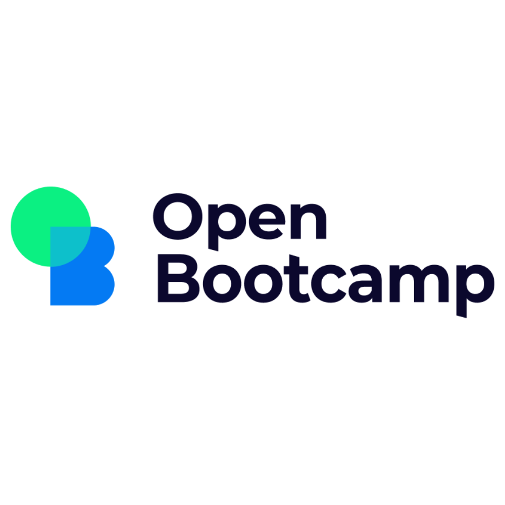

# Curso OpenBootCamp Spring Boot

# Ejercicio 1: 

1. Crear proyecto maven con la dependencia spring-context y crear una clase Saludo con un método imprimirSaludo que imprima un texto por consola.
2. Crear el archivo beans.xml con un bean para la clase Saludo.
3. Obtener el bean desde el método main y ejecutar el método imprimirSaludo.

# Ejercicio 2:
1. Crear la clase NotificationService, con un método que imprima un saludo.
2. Crear una clase UserService que tenga un atributo de clase NotificationService.
3. Utilizar la anotación @Component en cada clase.
4. Habilitar el escaneo de clases en el archivo beans.xml
5. Desde el método main, probar a obtener el bean UserService y ejecutar el método imprimirSaludo que tiene asociado el atributo de tipo NotificationService. De forma similar a la realizada en clase.

# Ejercicio 3:

1. Crear un proyecto Spring Boot con las dependencias: Spring Data JPA, H2

En caso de querer que la base de datos se guarde en disco habrá que añadir las siguientes propiedades en el archivo application.properties:
*spring.jpa.show-sql=true
*spring.datasource.url=jdbc:h2:file:C:/data/sample
*spring.datasource.username=sa
*spring.datasource.password=
*spring.datasource.driverClassName=org.h2.Driver
*#spring.jpa.hibernate.ddl-auto=create
*spring.jpa.hibernate.ddl-auto=update
*spring.sql.init.mode=always
*spring.jpa.defer-datasource-initialization=true

# Ejercicio 4

1. Crear un proyecto Spring Boot con las dependencias:
	*H2
	*Spring Data JPA
	*Spring Web
	*Spring Boot dev tools
2. Crear una clase HelloController que sea un controlador REST. Dentro de la clase crear un método que retorne un saludo. Probar que retorna el saludo desde el navegador y desde Postman.

# Ejercicio 5

1. Dentro de la misma app crear las clases necesarias para trabajar con "ordenadores":
	*Laptop (entidad)
	*LaptopRepository (repositorio)
	*LaptopController (controlador)
	*Desde LaptopController crear un método que devuelva una lista de objetos Laptop.
2. Probar que funciona desde Postman.
3. Los objetos Laptop se pueden insertar desde el método main de la clase principal.

# Ejercicio 6

1. Crear un método en LaptopController que reciba un objeto Laptop enviado en formato JSON desde Postman y persistirlo en la base de datos.
2. Comprobar que al obtener de nuevo los laptops aparece el nuevo ordenador creado.

# Ejercicio 7

1. Implementar los métodos CRUD en el API REST de Laptop creada en ejercicios anteriores.
	Los métodos CRUD:
	* findAll()
	* findOneById()
    * create()
	* update()
	* delete()
	* deleteAll()
	
# Ejercicio 8

1. Implementar swagger sobre el API REST de Laptop y verificar que funciona en la URL: http://localhost:8081/swagger-ui/index.html

# Ejercicio 9

1. Crear casos de test para el controlador de Laptop desde Spring Boot. Con click derecho dentro del código de la clase LaptopController utilizar la opción Generate > Test para crear la clase con todos los tests unitarios e implementarlos siguiente el proceso visto en clase.

# Ejercicio 10

1. Probar a empaquetar la aplicación con maven package desde Intellij IDEA
2. Desde terminal en Intellij IDEA verificar que se se ejecuta correctamente con el comando: java -jar target/spring-deploy-1.0.jar
3. Crear un perfil para dev y otro para test con una propiedad nueva que carguemos en el controlador.

# Ejercicio 11

1. Desplegar el API REST de Laptops en Heroku y verificar funcionamiento desde POSTMAN.

# Ejercicio 12

1. Añadir Spring Security sobre el proyecto API REST de Laptops y configurar 2 usuarios en memoria utilizando una clase WebSecurityConfig.
